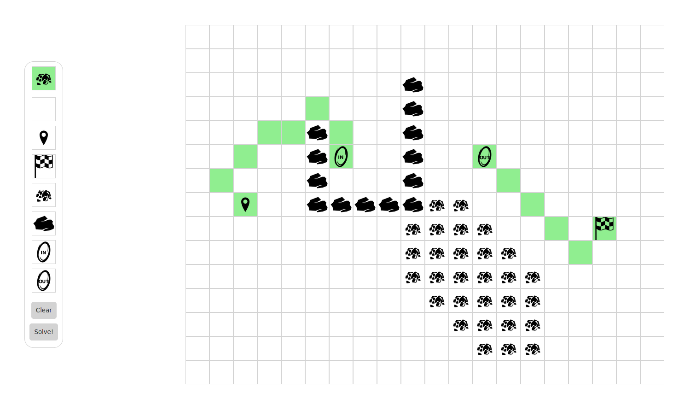

# obstacle-course-solver
A full-stack-ish technical challenge for a company.

The goal of the challenge was to create an obstactle course solver that works on a grid of interconnected fields with various, well obstacles on it. Additional task was to add support for "wormholes" - fields that connect to another, distant field - and ensure that the solver can handle these.
The solution is an implementation of the field editor along with a backend A*-based solver. Two heuristics are provided, "distance" and "zero" that handles the wormhole use case.

Here's how it looks:



## Testing, building & running
### Backend part
To run the included tests (hopefuly I wrote some ¯\\\_(ツ)\_/¯) run either of the following commands:

```
sbt clean-test
```

To build & package the project:

```
sbt clean-compile
sbt docker:publishLocal
```

Ensure that the Docker daemon is up an running in order to create an image. The image will be based on `openjdk:8` so it'll download a bit of crap on the first run. To then run the backend execute either command:

```
sbt run
docker run -p 8081:1234 -e REST_HOST=0.0.0.0 -e REST_PORT=1234 -e LOG_LEVEL=DEBUG obstacle-course-be:latest
```

### Frontend part
To run the tests:

```
npm run test # Runs the tests inside of Firefox & Chrome.
npm run test:ci # Runs tests inside of a headless browser.
npm run test:watch # Runs the tests in an interactive mode - suitable for development.
```

To build the project:

```
npm run build # Builds a debug version of the project.
npm run build:release # Builds a "release" "optimized" version of the project.
npm run build:watch # Rebuilds the project automatically on any source changes.
```

To package the project with Docker ensure that the Docker daemon is running and run:

```
npm run package
```

To run the project after building the image simply execute:

```
docker run -p 8080:80 -e BACKEND_URL="localhost:8081" obstacle-course-fe:latest
```

Alternatively, you can start a static file server inside of the `dist` directory instead of building a Docker image for the frontend.

## Description of the solution
### Frontend part
The frontend was written in TypeScript using Preact & Mobx. Mobx was chosen because of how minimalistic it is as compared to other implementations of Flux storage - instead of large amount of boilerplate I could focus entirely on delivering features without complicating their implementation needlessly. Preact was chosen due to smaller size than some of the alternatives (the whole app takes only 132k with assets, without gzipping). The app consists of a main store & user actions, backend API service, several containers (a.k.a. smart-componnents) and a few layout components. Unfortunately time was shor, so I did not include a diagram of how it all works.

### Backend part
The backend part was written in Scala mostly in functional style although there were very few spots where that could be taken advantage of. The solver and A* implementation is unfortunately written in imperative style - functional version would be too time consuming for this challenge.

## Caveats
Some liberties were taken during the development:

- Frontend isn't responsive nor follows any coherent desings - I'm not much of a UI designer, so I didn't bother with the looks as much as with the inner workings down the stack.

- Field & board configuration is served by the backend and can be changed fairly easily without changing the frontend client.

- The A* implementation on the backend is written in an imperative way making it pretty ugly.

- The default heuristic for the A* algorithm is not addmissible in presence of Worm Holes making it find sub-optimal paths. A second, "zero-distance" heuristic was provided, turning the A* into a Dijkstra variant searching for optimal paths (turned on with `HEURISTIC=zero` env parameter).

- Sometimes paths look weird even though they are optimal - there is no penalty for moving diagonally.

- The code is missing a lot of tests, that's mostly because of lack of time for this assignment.
